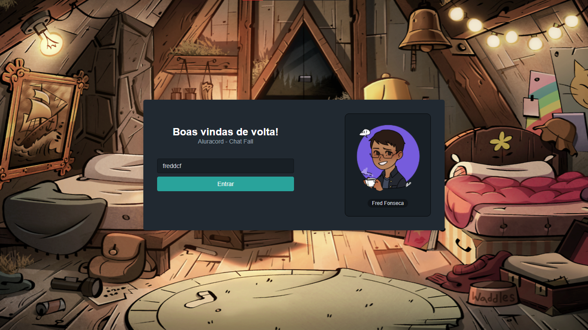
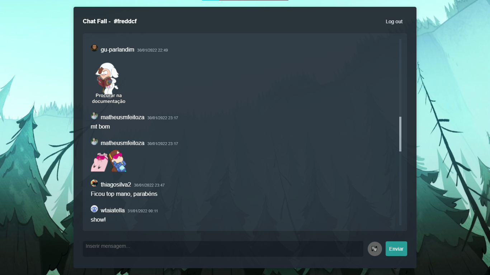

# Chat Fall

Este é um projeto criado na imersão React com a @alura @omariosouto @peas

## Tema: Gravity Falls

## Sobre

Desenvolvido durante a Imersão react 4 da Alura, esse projeto trata-se de uma aplicação online que propõe um chat realtime projetado em ***React*** com o framework ***Next.js***.

## Tecnologias predominantes

* React (Library)
* Next.js (Framework)
* SkynexUI (Style Library)
* Supabase (Online Database)

## Alterações adicionais em relação a aplicação proposta

* Implementação de layout responsivo
* Implementação de página Not Found (404)
* Fetch com dados de usuários da API do GitHub
* Utilização de Variáveis de Ambiente protegidas do usuário
* Implementação lógica do Debounce
* Adição de pacote de stickers tematizados
* Mensagens podem ser apagadas apenas pelo remetente
* Adição de imagens customizadas ao layout
* Utilização de React Library para animação de carregamento do chat

## Preview here

***Check online [demo](https://aluracord-chatfall.vercel.app/) on Vercel here! And let's chat...***

## Contribuições

1. Use Fork no projeto.
2. Crie uma branch para novas mudanças.
3. Descreva os novos resultados.
4. Submita um Pull Request.
